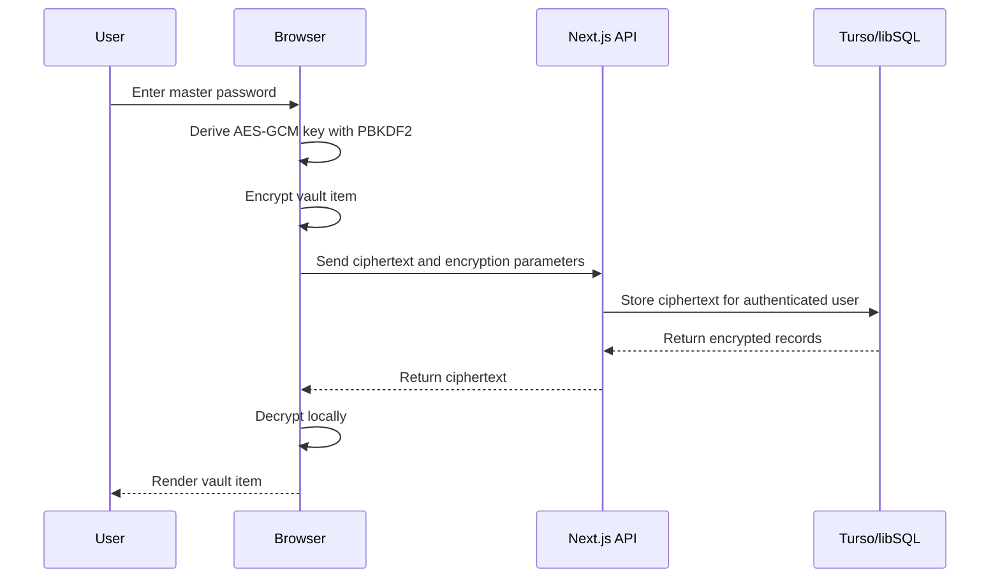

# Opaque Vault

Opaque Vault is an experimental encrypted password vault. Vault items are encrypted and decrypted in the browser; the server stores ciphertext, key-derivation parameters, sessions, and optional searchable metadata.

[Live demo](https://opaque-theta.vercel.app) · [Repository](https://github.com/Elijah-cod/Opaque)

> This project has not received an independent security audit. Treat it as an engineering demonstration, not as a replacement for an audited password manager.

## Security Model

- The browser derives a 256-bit AES-GCM key from the master password with PBKDF2-SHA-256 and a random salt.
- PBKDF2 currently uses 600,000 iterations for vault encryption and authentication-verifier derivation.
- Vault item plaintext and the derived encryption key are not intentionally sent to the server.
- Turso/libSQL stores ciphertext, IVs, salts, iteration counts, ownership records, and optional server-visible metadata.
- Server authentication uses HTTP-only session cookies. Email OTP is available when Resend is configured; a legacy verifier flow remains available behind `OPAQUE_ENABLE_LEGACY_AUTH`.
- The in-memory vault key is cleared on inactivity or tab blur. A tab-scoped unlock handoff supports navigation without persisting the key to durable browser storage.

The server can still observe account identifiers, access timing, item counts, ciphertext sizes, and any optional metadata. A compromised client or malicious script executing in the application origin could capture plaintext or key material. The current design has not been formally verified.

## Architecture



## Current User Flows

- **Free mode:** create a vault, retain the generated user ID, and unlock with the user ID and master password.
- **Email OTP mode:** configure Resend to authenticate through the OTP API routes.
- **Vault:** create, list, update, and delete encrypted items after local unlock.

## Stack

- Next.js 16 and React 19
- TypeScript and Web Crypto
- Turso/libSQL
- Tailwind CSS
- Zod
- Resend-compatible email OTP flow

## Local Development

### Requirements

- Node.js 20 or later
- npm
- A Turso/libSQL database

### Setup

1. Apply [`web/src/lib/schema.sql`](web/src/lib/schema.sql) to a new database. For a database created with the older schema, apply [`web/src/lib/migrations/001_prod_auth.sql`](web/src/lib/migrations/001_prod_auth.sql) once.
2. Copy [`web/.env.example`](web/.env.example) to `web/.env.local` and provide the required values.
3. Install dependencies and start the development server:

```bash
cd web
npm install
npm run dev
```

4. Open [http://localhost:3000](http://localhost:3000).

## Environment Variables

```env
TURSO_DATABASE_URL="libsql://..."
TURSO_AUTH_TOKEN="..."
RESEND_API_KEY="re_..."
RESEND_FROM="Opaque Vault <noreply@example.com>"
OPAQUE_ENABLE_LEGACY_AUTH="0"
```

Resend values are needed only for email OTP. Keep the legacy auth flag disabled unless migrating an existing deployment that requires it.

## Verification

Run the quality checks from `web/`:

```bash
npm run lint
npm run build
```

The repository includes a CI workflow for lint and build checks. Automated cryptographic and end-to-end tests are still needed before the project should be considered security-sensitive software.

## Known Limitations

- No independent security audit or formal threat-model review has been completed.
- Optional searchable metadata is visible to the server.
- PBKDF2 parameters are fixed defaults rather than calibrated per device.
- Recovery is intentionally limited: losing both the master password and required account identifier can make the vault inaccessible.
- The project does not currently provide browser extensions, autofill, sharing, or import/export compatibility with established password managers.
